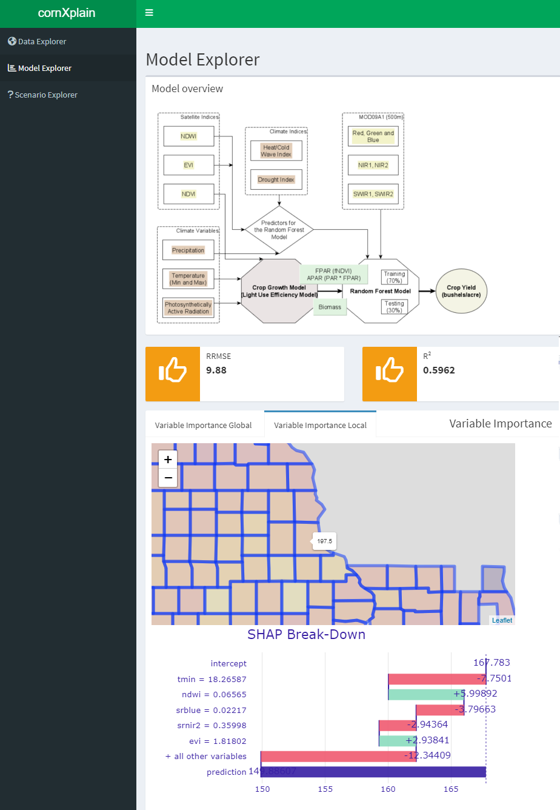

# cornXplain

 

An app for explainable and interactive crop modeling, contribution to the 
[ML4Earth-Hackathon-2022](https://github.com/zhu-xlab/ML4Earth-Hackathon-2022) 

## Inspiration

Many good tools for crop modeling and explainability are available. However, they usually require coding skills to use.
**cornXplain** is an attempt to reduce the entry barrier to explainable crop modeling, and create an interactive, browser-like environment that strips away the complexity of a GIS or programming language. By being accessible and responsive, exploring crop models can be fun.

## What it does
We create a three-component dashboard linking around a speedy crop model. The three components allow the user to explore the input **data**, the **model** performance and variable importances, and counterfactual **scenarios**.

### Data Explorer
Allows the user to visualize the data that goes **into** the model.

 
### Model Explorer
A quick overview of the models structure with key performance metrics. This gives the user at-a-glance information about how the model functions, how good it is, and which variables it uses.

 
### Scenario Explorer
Here, the user can change the environmental variables that are input to the model - within reason - to explore possible scenarios and how the model responds to changes in certain variables.

 
 
 

